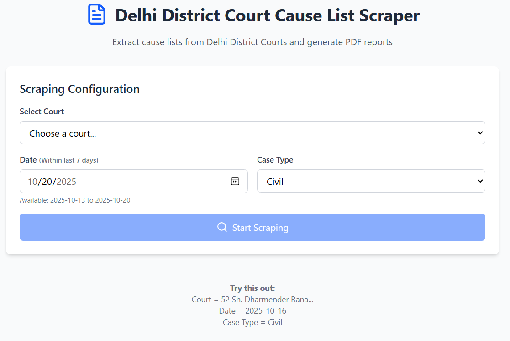
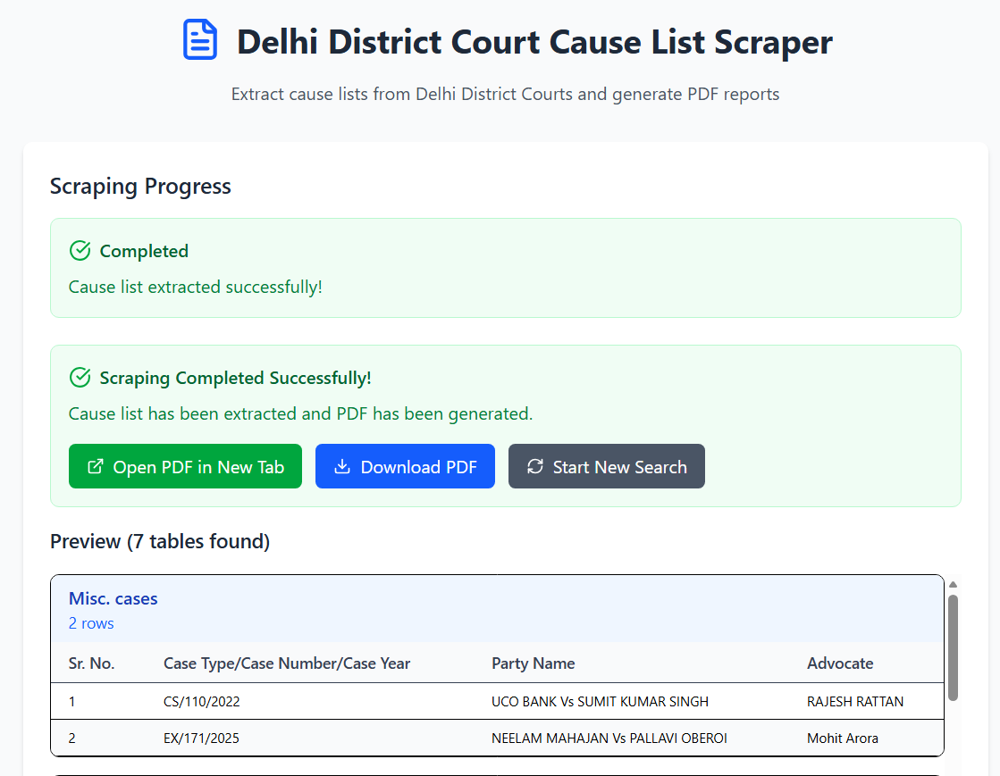

# Delhi District Court Cause List Scraper

A full-stack application to automatically extract cause lists from Delhi District Courts and generate PDF reports.

## Features

- 🏛️ **All Delhi District Courts** - Access cause lists from all court complexes
- 📅 **Date Selection** - Extract cause lists within the last 7 days
- ⚖️ **Case Types** - Support for both Civil and Criminal cases
- 🤖 **CAPTCHA Handling** - Manual solving with optional auto-solve
- 📄 **PDF Generation** - Clean, formatted PDF reports
- 🌐 **Web Interface** - Modern React frontend with real-time status updates
- 📊 **Data Preview** - View extracted data before downloading

## Tech Stack

- **Backend**: FastAPI + Selenium + ReportLab
- **Frontend**: React + Vite + TailwindCSS
- **Browser**: Chrome WebDriver

## Installation

### Prerequisites

- Python 3.8+
- Node.js 16+
- Chrome Browser

### 1. Clone Repository

```bash
git clone https://github.com/Rohit1419/web-scrapper.git
cd ecourt-scrapper
```

### 2. Install UV Package Manager

If UV is not installed on your system:

```bash
pip install uv
# Or follow the official guide: https://docs.astral.sh/uv/getting-started/installation/
```

### 3. Backend Setup

```bash
# Install Python dependencies using UV
uv add fastapi[standard] selenium webdriver-manager uvicorn reportlab requests

# Or sync all dependencies
uv sync
```

### 4. Frontend Setup

```bash
cd scrapper-frontend
npm install
```

### 5. Chrome WebDriver

WebDriver will be automatically downloaded when first run.

## Running the Application

### Method 1: Full Stack (Recommended)

**Terminal 1 - Backend:**

```bash
uv run main.py
# Server runs on http://localhost:8000
# API docs available at http://localhost:8000/docs
```

**Terminal 2 - Frontend:**

```bash
cd scrapper-frontend
npm run dev
# App runs on http://localhost:5173
```

### Method 2: Standalone Scraper

```bash
# Run command-line scraper
uv run delhi_scrappper.py
# Follow interactive prompts
```

## Usage

### Web Interface

1. Open http://localhost:5173
2. Select court from dropdown
3. Choose date (within last 7 days) and case type
4. Click "Start Scraping"
5. Solve CAPTCHA in the browser window that opens
6. Return to frontend and click "I've Solved the CAPTCHA"
7. Download/view generated PDF when complete

## Screenshots

### 1. Homepage - Court Selection



### 2. CAPTCHA Solving Process


### 3. Final Results with PDF Download



### API Endpoints

```
GET  /api/courts                           # Get available courts
POST /api/scrape/start                     # Start scraping session
GET  /api/scrape/status/{session_id}       # Check scraping status
POST /api/scrape/captcha-solved/{session_id} # Confirm CAPTCHA solved
```

### Standalone Scraper

```bash
uv run delhi_scrappper.py
# Follow interactive prompts to select court, date, and case type
```

## File Structure

```
ecourt-scrapper/
├── main.py                 # FastAPI server
├── delhi_scrappper.py      # Main scraper logic
├── captcha_solver.py       # Auto CAPTCHA solving (optional)
├── delhi_scrapper_auto.py  # Auto-solve test script
├── downloads/              # Generated PDF files
└── scrapper-frontend/      # React frontend
    ├── src/
    │   ├── App.jsx         # Main app component
    │   ├── api.js          # API service layer
    │   ├── constant.js     # App constants
    │   ├── components/     # React components
    │   └── hooks/          # Custom React hooks
    └── package.json
```

## Troubleshooting

### Common Issues

**Chrome Driver Error:**

```bash
# Install WebDriver manager manually
uv add webdriver-manager
```

**Frontend Connection Error:**

- Ensure backend is running on port 8000
- Check CORS settings in `main.py`
- Verify no firewall blocking localhost connections

**No Courts Loading:**

- Check internet connection
- Ensure court website is accessible
- Try running standalone scraper first

### Debug Mode

```bash
# Backend with auto-reload
uv run main.py --reload

# Frontend with detailed logging
cd scrapper-frontend
npm run dev
```

## CAPTCHA Handling

### Manual Solving (Recommended)

- Browser window opens automatically
- Solve CAPTCHA visually
- Return to frontend and confirm

### Auto-Solving (Experimental)

```bash
# Test auto-solving with 2captcha service
python delhi_scrapper_auto.py

# Note: Requires 2captcha API key and credits
# Success rate varies, manual solving more reliable
```

## Output

- **PDF Files**: Saved to `downloads/` directory
- **Naming**: `cause_list_{court_name}_{date}.pdf`
- **Format**: Structured tables with headers and case details
- **Preview**: Available in web interface before download

## Legal Notice

⚠️ **Important**: This tool is for educational and research purposes only.

Please ensure compliance with:

- Website Terms of Service
- Applicable laws and regulations
- Court policies on data access
- Responsible usage practices

## Quick Start

```bash
# 1. Clone and setup
git clone https://github.com/Rohit1419/web-scrapper.git
cd ecourt-scrapper

# 2. Install dependencies
uv sync && cd scrapper-frontend && npm install && cd ..

# 3. Start backend
uv run main.py

# 4. Start frontend (new terminal)
cd scrapper-frontend && npm run dev

# 5. Open browser
# Navigate to http://localhost:5173
```

## Contributing

1. Fork the repository
2. Create a feature branch
3. Make your changes
4. Submit a pull request

## License

This project is for educational purposes. Use responsibly and in accordance with applicable laws.
